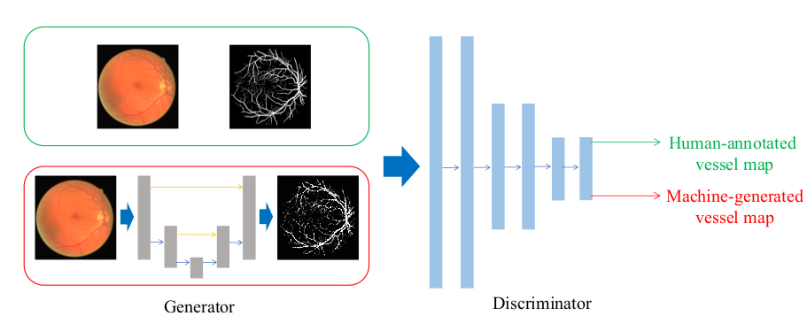

# vessel-gan-pytorch
The code is an pytorch implementation of [《Retinal Vessel Segmentation in Fundoscopic Images with Generative Adversarial Networks》](https://arxiv.org/abs/1706.09318)

---

## Overview

### Data

[DRIVE: Digital Retinal Images for Vessel Extraction](http://www.isi.uu.nl/Research/Databases/DRIVE/) you can download the train and test data from this server. You can also find data in the eyedata folder.

### Pre-processing

The dataset contains 20 training images, the first step of my pre-processing is randomly cropping into 512*512. The second step is to randomly change brightness ,contrast and hue of the train image. I implement this method in my code, so you can be convenient to use it. Further more, a gan-based method of generating retina images can be used as an extra data source. 

### Model



### Training

python train.py

---

## How to use

### Dependencies

This code depends on the following libraries:

* Python 3.6
* Pytorch
* PIL

### structure
```
vessel gan
│
├── eyedata  # drive data
│ 
├── gycutils # my utils for data augmentation
│ 
├── Criterion.py # generate and store precison,recall curve 
│ 
├── datasets.py # dataset for dataloader
│ 
├── gan.py # generative adversial network for vessel segmentation
│ 
├── train.py # train code
│
├── transform.py 
│
└── readme.md # introduce to this project
```


